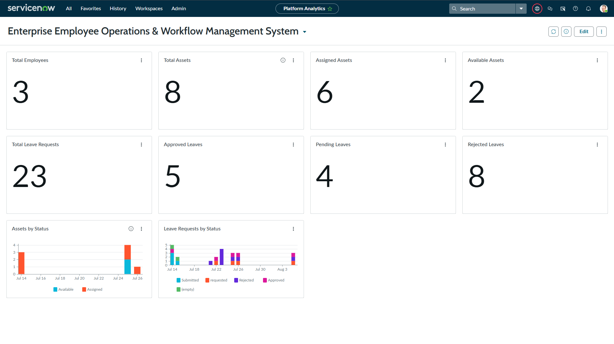
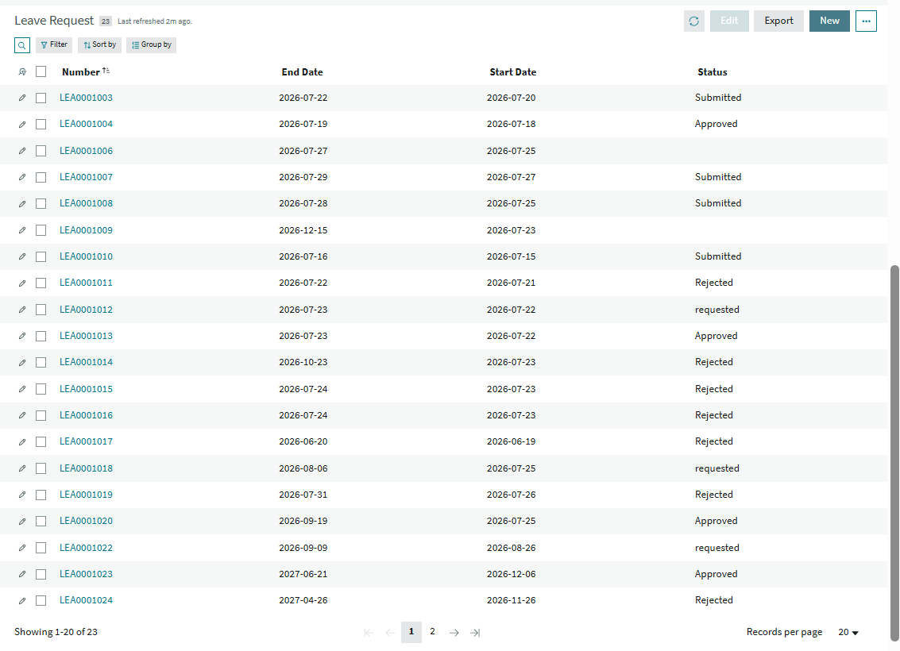
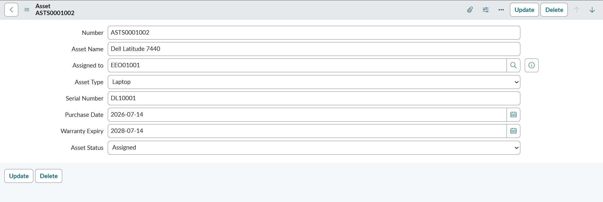
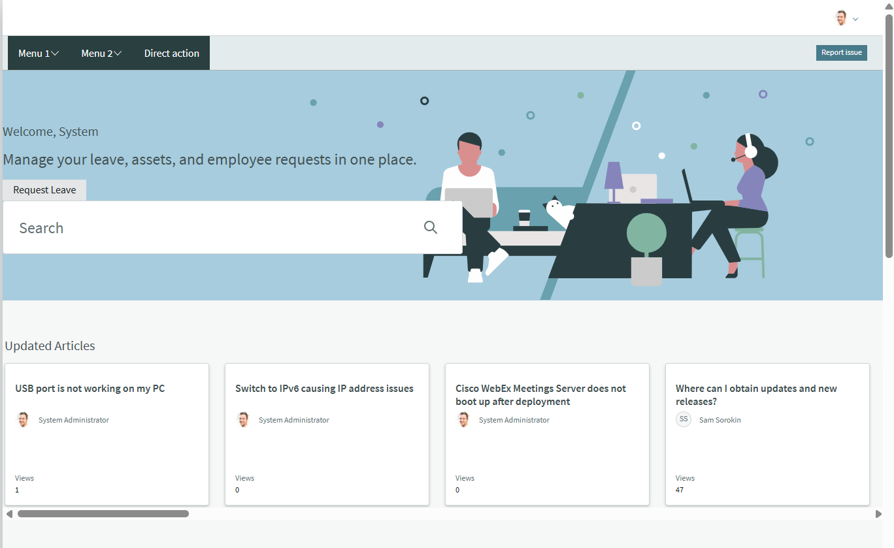
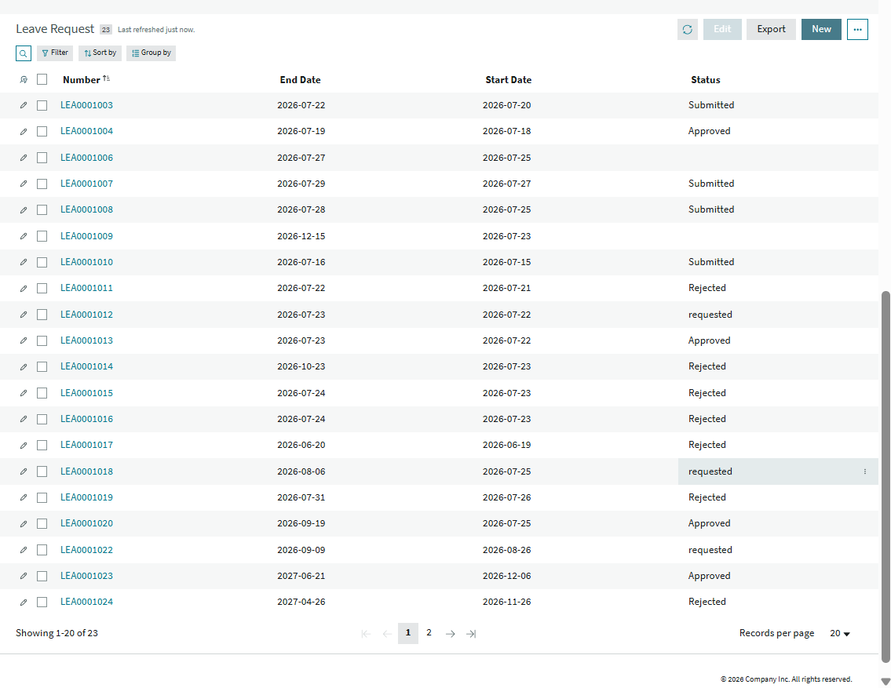
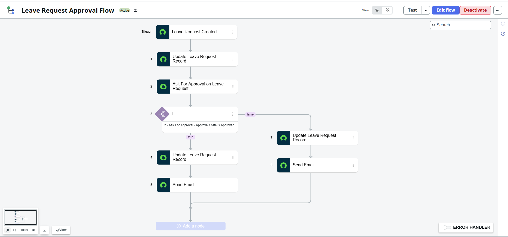

# Enterprise Employee Operations & Workflow Management System

## 📌 Project Overview

The **Enterprise Employee Operations & Workflow Management System** is a custom ServiceNow application designed to centralize and automate employee operations through workflow-driven processes.

The application brings together employee management, leave management, asset management, approvals, notifications, employee self-service, and operational analytics into a centralized platform.

## 🎯 Problem Statement

Enterprise employee operations can involve multiple manual processes for managing employee information, leave requests, approvals, asset assignments, notifications, and request tracking.

This can result in repetitive administrative work, inconsistent status tracking, delayed approvals, and limited operational visibility.

This project addresses these challenges by using **ServiceNow application development and workflow automation** to standardize and automate key employee operations.

## 💡 Proposed Solution

The system provides a centralized platform where employees and administrators can manage employee operations through structured records and automated workflows.

The application supports:

* Employee information management
* Leave request submission and tracking
* Automatic leave-day calculation
* Leave approval and rejection workflows
* Asset assignment and lifecycle tracking
* Automatic asset status updates
* Workflow-based notifications
* Employee self-service
* Operational dashboards and data visualization

## 🚀 Key Features

### 👤 Employee Management

* Centralized employee records
* Employee identification and work information
* Employee-based operational data
* Employee-related request management

### 🏖️ Leave Management

* Employee leave request submission
* Start date and end date validation
* Prevention of invalid date ranges
* Automatic calculation of total leave days
* Automated approval workflow
* Approve and reject functionality
* Automatic request status updates
* Employee request tracking

### 💻 Asset Management

* Centralized asset records
* Asset assignment to employees
* Automatic asset status management
* Assigned and Available asset states
* Asset lifecycle tracking

### 🔄 Workflow Automation

* Automated approval processes using ServiceNow Flow Designer
* Conditional workflow logic
* Automatic record updates
* Workflow-driven status management
* Reduced manual processing

### 📧 Notifications

* Automated notification workflows
* Email notification configuration
* Workflow-based notification handling
* Notifications associated with request outcomes

### 🌐 Employee Portal

* Employee-facing portal experience
* Request submission
* Request tracking
* Status visibility
* Centralized access to employee operations

### 📊 Dashboard & Analytics

* Operational record counts
* Graphical data visualization
* Centralized view of application activity
* Quick visibility into employee operations
* Operational monitoring through dashboard components

## 📂 Application Modules

| Module                | Purpose                                                     |
| --------------------- | ----------------------------------------------------------- |
| Employee Management   | Manage centralized employee information                     |
| Leave Management      | Submit, validate, approve, reject, and track leave requests |
| Asset Management      | Track assets, assignments, and availability                 |
| Workflow Automation   | Automate approvals, conditions, and record updates          |
| Notifications         | Communicate workflow outcomes                               |
| Employee Portal       | Provide employees with self-service access                  |
| Dashboard & Analytics | Provide operational counts and graphical insights           |

## 🔄 Leave Request Workflow

**Employee submits leave request**

↓

**Start and end dates are validated**

↓

**Total leave days are calculated automatically**

↓

**Approval request is generated**

↓

**Request is approved or rejected**

↓

**Leave request status is updated**

↓

**Employee views updated status**

## 🔄 Asset Assignment Workflow

**Asset is created or updated**

↓

**System checks whether the asset is assigned to an employee**

↓

**Assigned → Asset status becomes Assigned**

**Unassigned → Asset status becomes Available**

## 🧮 Automated Leave-Day Calculation

The application automatically calculates the total number of leave days based on the selected start and end dates.

For example:

**25th → 28th = 4 total days**

The system also validates the date range and prevents an end date from occurring before the start date.

## ⚙️ ServiceNow Development Components

The application demonstrates multiple ServiceNow development capabilities:

* App Engine Studio
* ServiceNow Studio
* Custom Applications
* Custom Tables
* Custom Fields
* Forms
* Flow Designer
* Business Rules
* Client-side scripting
* UI Builder
* Employee Portal
* Notifications
* Approval workflows
* Dashboard and data visualization
* ServiceNow Source Control

## 🏗️ Application Architecture

The application follows a workflow-driven architecture built on the ServiceNow platform.

### Data Layer

* Employee Table
* Asset Table
* Leave Request Table
* Custom fields and relationships

### Business Logic Layer

* Business Rules
* Date validation
* Automatic leave-day calculation
* Asset status logic

### Workflow Layer

* Flow Designer
* Approval processes
* Conditional logic
* Automated record updates
* Notification workflows

### User Interface Layer

* Employee Portal
* UI Builder components
* Request tracking interfaces
* Dashboard and visualization components

### Version Control

* ServiceNow Source Control
* GitHub repository
* Git-based application version history

## 🧪 Testing & Validation

The application's core functionality was tested through multiple scenarios.

### Leave Management

* Leave request creation
* Total leave-day calculation
* Invalid date validation
* Approval workflow generation
* Leave approval
* Leave rejection
* Employee status visibility

### Asset Management

* Asset assignment
* Assigned asset status
* Asset unassignment
* Available asset status

### Workflow & Application

* Flow execution
* Conditional workflow branches
* Automatic record updates
* Notification workflow configuration
* Portal functionality
* Dashboard and analytics components

## 📸 Screenshots

### 📊 Dashboard & Analytics

### 🏖️ Leave Requests

### 💻 Asset Management

### 🌐 Employee Portal

#### Portal Overview

#### Leave Request Tracking

### 🔄 Leave Approval Workflow

## 📈 Project Outcome

The project demonstrates the development of an enterprise-oriented ServiceNow application combining:

* Custom application development
* Data modeling
* Business logic
* Workflow automation
* Approval management
* Notifications
* Employee self-service
* Operational dashboards
* Source control and version management

The resulting platform provides a centralized approach to employee operations while reducing repetitive manual processing and improving request and asset visibility.

## 🔐 Source Control & Version Management

The application is connected to **GitHub through ServiceNow Source Control**.

The GitHub repository contains the application's generated ServiceNow source files and commit history, providing version tracking and a source-controlled representation of the application.

## 🚀 Future Enhancements

* Advanced role-based access and personalization
* Additional employee service workflows
* Integration with external enterprise systems
* Advanced reporting and analytics
* Expanded dashboard capabilities
* Additional automation for HR and IT operations
* AI-assisted employee service capabilities

## 🛠️ Technology Stack

**Platform:** ServiceNow

**Development:** App Engine Studio, ServiceNow Studio, Flow Designer, UI Builder

**Programming:** JavaScript

**Application Components:** Custom Tables, Forms, Business Rules, Client-side scripting, Notifications, Approval Workflows

**Version Control:** GitHub, ServiceNow Source Control

## 👩‍💻 Author

**Anoohya Sreeramdas**
